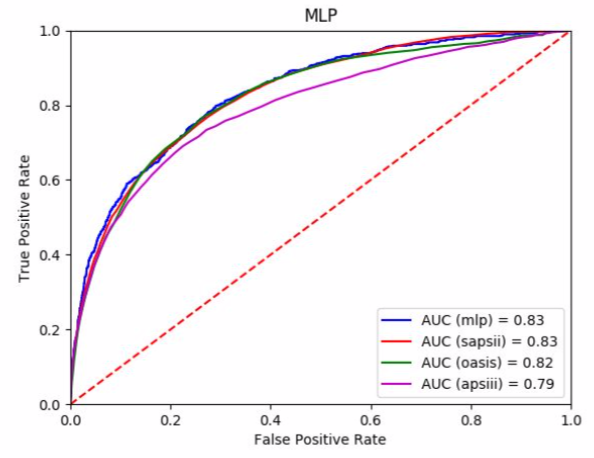
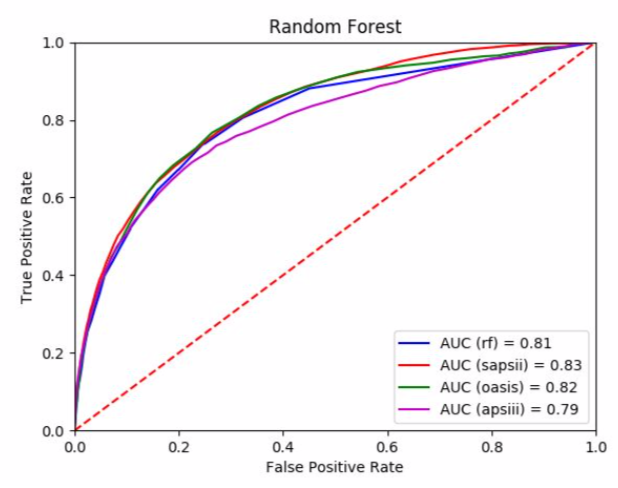
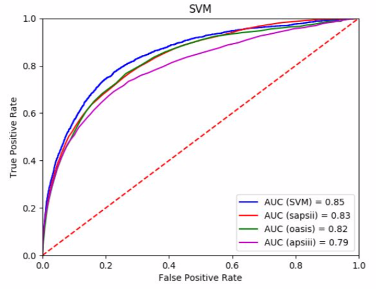
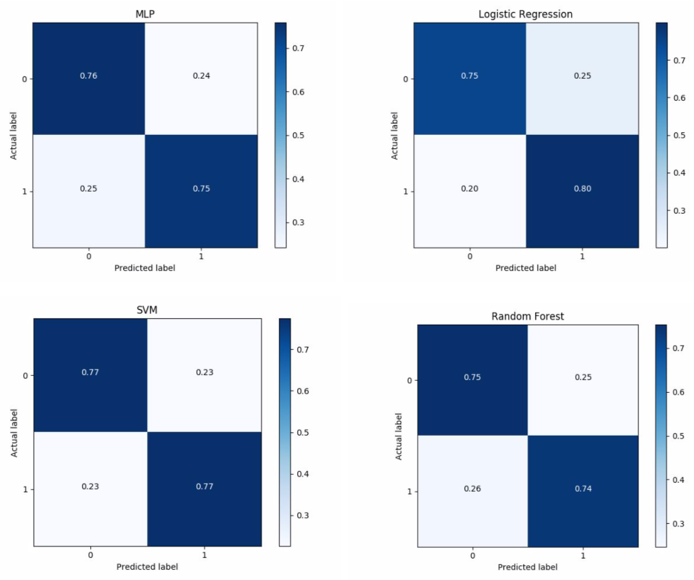
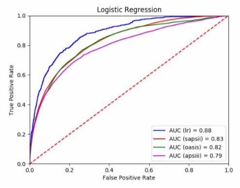
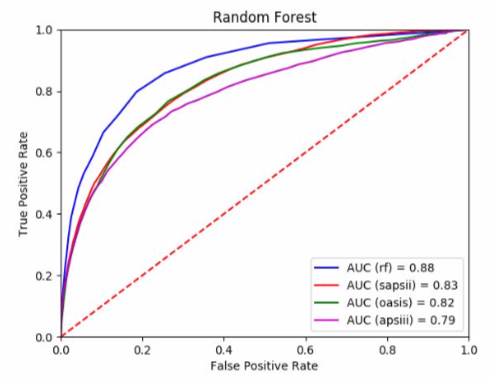
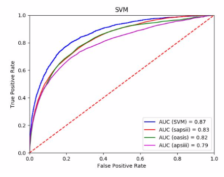
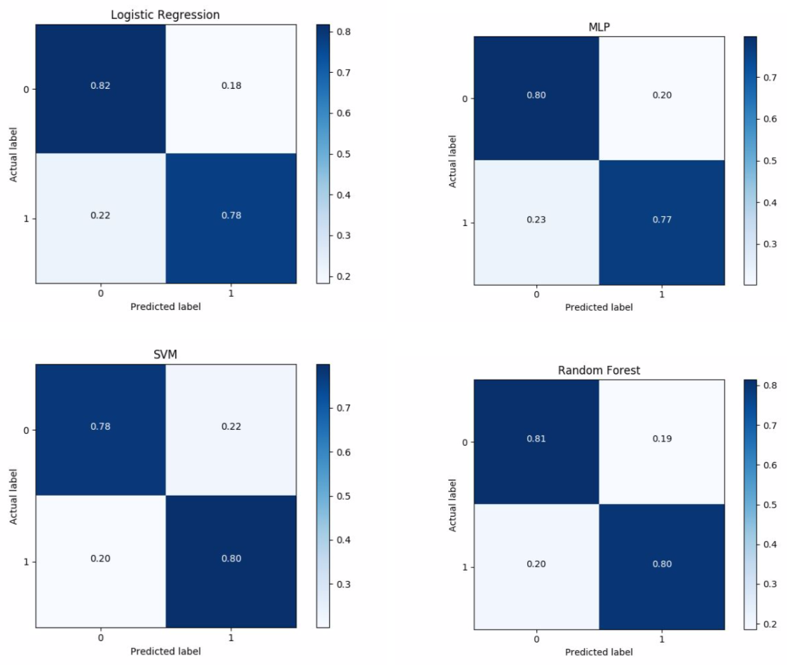
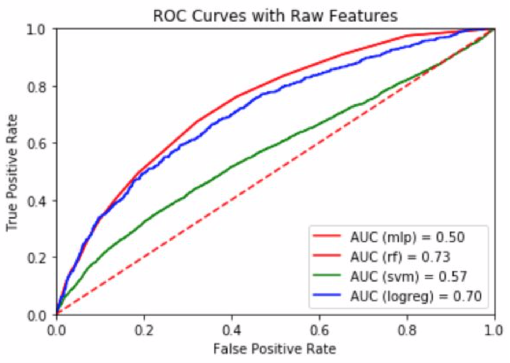

# Short Term Mortality Prediction

## Overview

The goal of this project is to improve the standard severity illness scoring systems by using the MIMIC-III dataset, of roughly 40,000 critical care patients, to develop a machine learning model that can accurately short term predict mortality in a set of ICU patients spanning a wide range of conditions and backgrounds.

In attempting to maximize the performance of the model, different combinations of input features drawing from vitals and demographic information, ICD-9 diagnosis codes, and disease severity scores such as the Apache II, SAPS II, and SOFA scores are explored. Additionally, the “EXPIRE_FLAG” provided in the MIMIC-III database is used to extract mortality labels for each patient. Using the available input features and these target mortality labels, a model that makes a binary prediction on the mortality status of a given patient is developed. Several tables from the MIMIC dataset will be used to gather these features; particularly, data from the “CHARTEVENTS”, “LABEVENTS”, “DIAGNOSES_ICD”, “D_ITEMS”, and “PRESCRIPTIONS” tables will be aggregated together to link each patient to their lab tests, what they have been diagnosed with, and also the current medications they are on. Both filtering and heuristic feature selection processes will then be used to reduce the dimensionality of the input feature map for a more efficient and precise model.

Three sets of machine learning models, Logistic Regression, Multilayer Perceptron, Random Forest, and Support Vector Machine, were developed to predict patient mortality and each set was trained on a different set of features. The images below highlight the performances of all models.

## Performance of Machine Learning models

### First Feature Set: Severity Illness Scores from SAPSII, OSASIS, and APSIII

### Second Feature Set: Sub_scores from Severity Illness Scores

### Third Feature Set: Raw Measurements Recorded for patients

